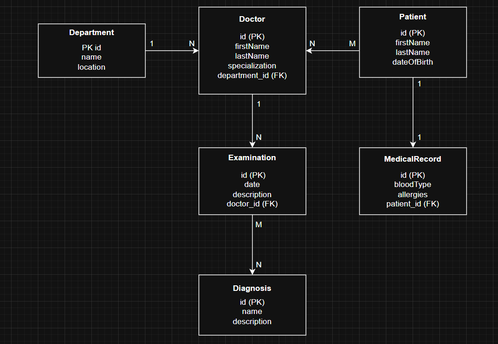
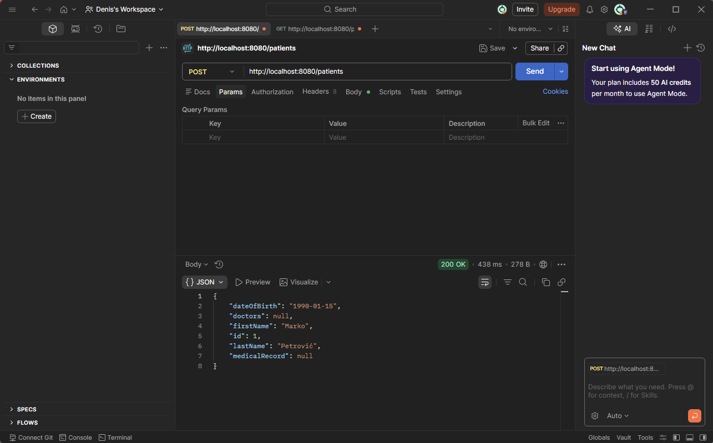
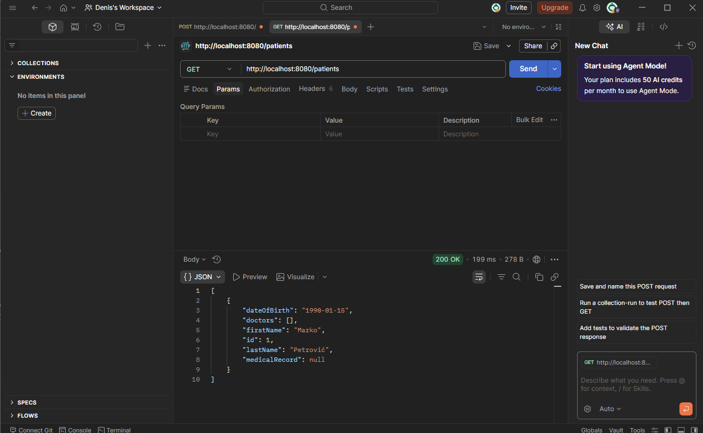

# PRO2 Homework

## Prvi domaci zadatak

### Opis projekta
Bolnički sistem razvijen u Quarkusu sa PostgreSQL bazom podataka.

## ER Dijagram

### Relacije
- Department → Doctor: OneToMany (1:N)
- Doctor → Examination: OneToMany (1:N)
- Patient ↔ MedicalRecord: OneToOne (1:1)
- Patient ↔ Doctor: ManyToMany (M:N)
- Examination ↔ Diagnosis: ManyToMany (M:N)

### API Endpoints
- `POST /patients` - dodavanje pacijenta
- `GET /patients` - dohvatanje svih pacijenata
- `POST /doctors` - dodavanje doktora
- `GET /doctors` - dohvatanje svih doktora

### Testiranje (Postman)

---

## Drugi domaci zadatak

### Nove @OneToOne relacije
- Doctor ↔ DoctorProfile
- Examination ↔ ExaminationReport

### FetchType.LAZY
Sve kolekcije su postavljene na FetchType.LAZY.

### Metode pretrage
- `GET /patients/search?firstName=` - pretraga pacijenata po imenu
- `GET /doctors/search?lastName=` - pretraga doktora po prezimenu

### Novi endpointi
- `GET /patients/{id}` - pacijent po ID-u
- `GET /doctors/{id}` - doktor po ID-u
- `GET /doctors/{id}/examinations` - pregledi doktora
- `GET /doctors/{id}/patients` - pacijenti doktora

### Scheduler
Quarkus @Scheduler loguje broj pacijenata u bazi svakih 60 sekundi.
