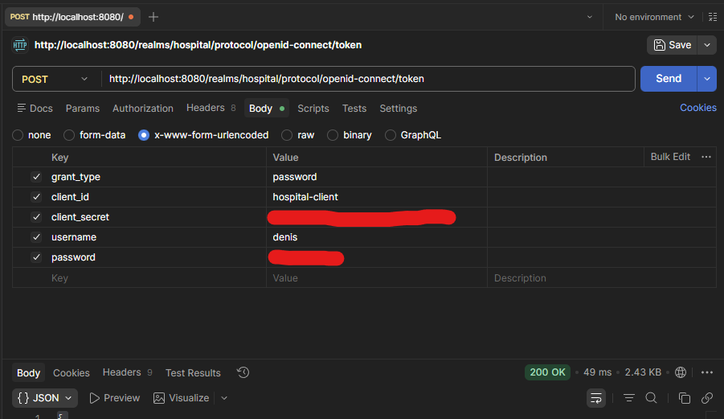
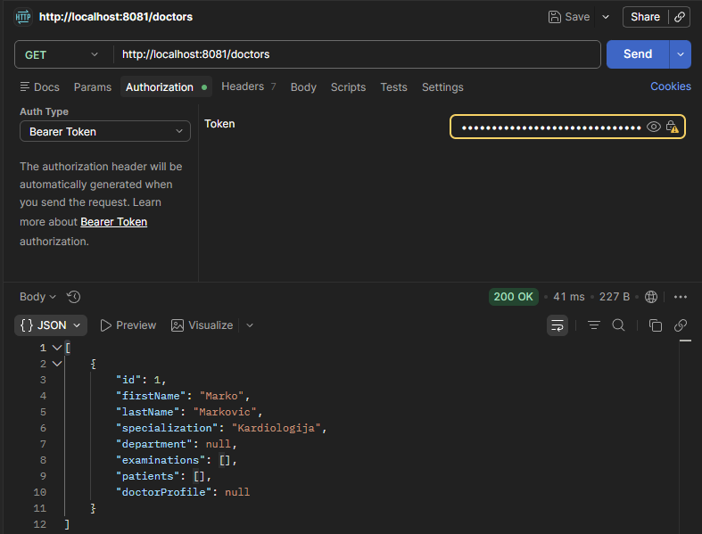
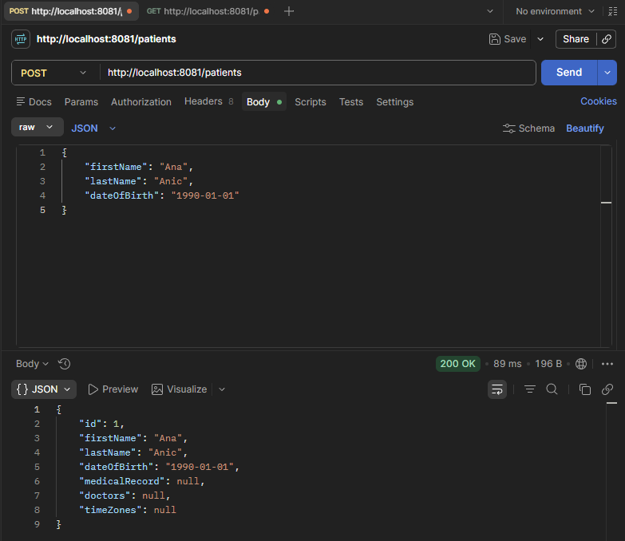
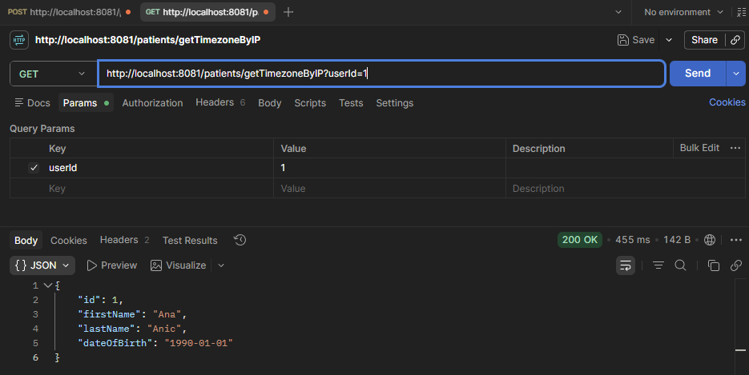
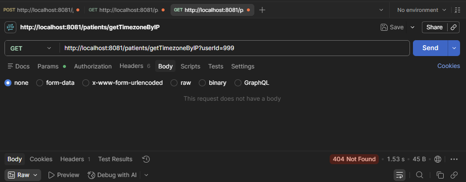

# PRO2 Homework
## Prvi domaci zadatak
### Opis projekta
Bolnički sistem razvijen u Quarkusu sa PostgreSQL bazom podataka.
## ER Dijagram

### Relacije
- Department → Doctor: OneToMany (1:N)
- Doctor → Examination: OneToMany (1:N)
- Patient ↔ MedicalRecord: OneToOne (1:1)
- Patient ↔ Doctor: ManyToMany (M:N)
- Examination ↔ Diagnosis: ManyToMany (M:N)
### API Endpoints
- `POST /patients` - dodavanje pacijenta
- `GET /patients` - dohvatanje svih pacijenata
- `POST /doctors` - dodavanje doktora
- `GET /doctors` - dohvatanje svih doktora
### Testiranje (Postman)

---
## Drugi domaci zadatak
### Nove @OneToOne relacije
- Doctor ↔ DoctorProfile
- Examination ↔ ExaminationReport
### FetchType.LAZY
Sve kolekcije su postavljene na FetchType.LAZY.
### Metode pretrage
- `GET /patients/search?firstName=` - pretraga pacijenata po imenu
- `GET /doctors/search?lastName=` - pretraga doktora po prezimenu
### Novi endpointi
- `GET /patients/{id}` - pacijent po ID-u
- `GET /doctors/{id}` - doktor po ID-u
- `GET /doctors/{id}/examinations` - pregledi doktora
- `GET /doctors/{id}/patients` - pacijenti doktora
### Scheduler
Quarkus @Scheduler loguje broj pacijenata u bazi svakih 60 sekundi.
---
## Treci domaci zadatak
### Keycloak integracija
Autentifikacija i autorizacija implementirana pomocu Keycloak-a.
### Konfiguracija
- Realm: `hospital`
- Client: `hospital-client`
- Rola: `admin`
### Zastita endpointa
Endpoint `GET /doctors` zastiscen anotacijom `@RolesAllowed("admin")` — dostupan samo korisnicima sa `admin` rolom.
### Testiranje (Postman)
Token se dobija POST requestom na Keycloak token endpoint, nakon cega se salje kao Bearer Token u Authorization headeru.

---
## Priprema za kolokvijum
### REST klijent za vremenske zone
Implementiran REST klijent koji dobija javnu IP adresu (ipify.org), a zatim na osnovu te IP adrese dobija podatke o vremenskoj zoni (timeapi.io).
### Veza
- Patient → TimeZone: OneToMany (1:N)
### Endpoint
- `GET /patients/getTimezoneByIP?userId=xxx` - pronalazi pacijenta po ID-u, poziva eksterne API-je i pridruzuje mu podatke o vremenskoj zoni
### Exception handling
Ukoliko pacijent sa proslijedjenim ID-jem ne postoji, baca se `NotFoundException` koja se mapira na HTTP status 404.
### Testiranje (Postman)

